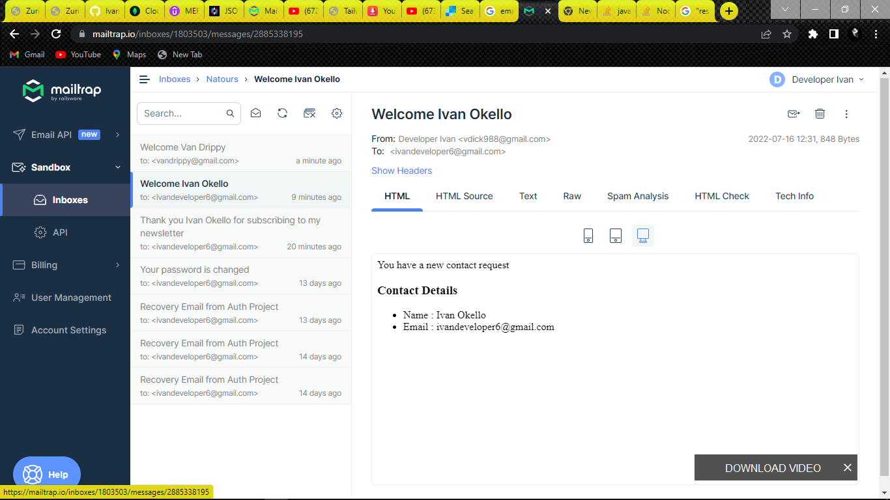

# **Sending Automated emails using Nodemailer and NodeJS**

### In this project , I have implemented email atomation using express and npm module `nodemailer`. I used `Mailtrap.io` which is a service for the safe testing of emails sent from the development and staging environments. Mailtrap catches your emails in a virtual inbox so that you can test and optimize your email campaigns before sending them to real users.
---
#### Below are Screenshots of the emails send and received by different `gmail` accounts

---

   ## 1. `Email sent to Van drippy account`

   ## 2.  `Email sent to Kreative Ivan account`

   ## 3.  `Email sent to Ivan Damien account`

   ## 4.  `Email sent to Van Dicy account` 

   ## 5.  `Email sent to Ivan Okello account`

